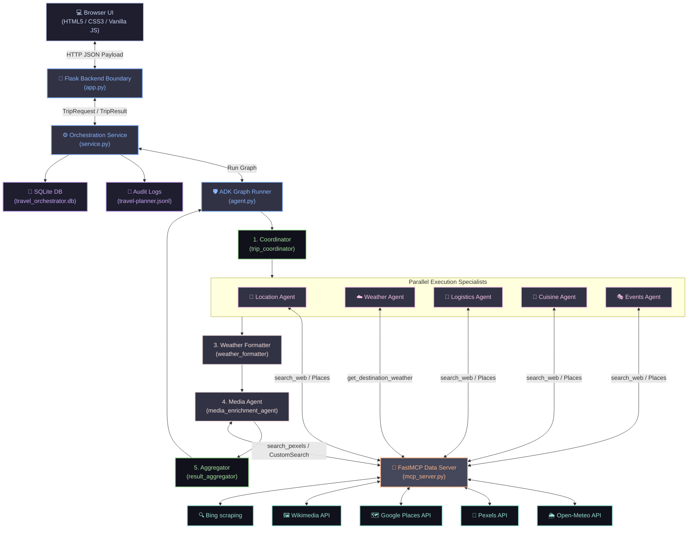

# ✈️ TripOrchestrator: A Secure, Grounded Multi-Agent Travel Planner

TripOrchestrator is a localized multi-agent travel planning application designed to compile highly factual, customized, and secure travel itineraries. The project is built using the Google Agent Development Kit (ADK) to coordinate specialised AI agents, a custom Model Context Protocol (MCP) server to connect models with real-world databases, a Flask-based secure boundary backend, SQLite database persistence, and a responsive vanilla JavaScript user interface.

## 🎓 Academic & Course Context

This project represents the final coursework for the **5-Day AI Agents: Intensive Vibe Coding Course With Google** offered by Kaggle, as well as the graduate discipline **PPGEEC2327 - Tópicos Especiais em processamento inteligente da informação**. This course is part of the Graduate Program in Electrical and Computer Engineering (PPGEEC) at the Federal University of Rio Grande do Norte (UFRN) in Brazil, and is taught by Prof. Dr. Ivanovitch Silva.

The application was designed and implemented by Hilton Thallyson, Lucas Torres, Miguel Euripedes, and Morsinaldo Medeiros.

---

## 🎯 1. Project Overview & Motivation

The development of TripOrchestrator was motivated by the practical planning challenges faced by academic researchers and professionals who frequently travel to international conferences, congresses, and symposia. When planning academic travel, researchers need to balance their tightly packed event schedules with exploring the host destination. TripOrchestrator satisfies this need by allowing users to schedule a trip on specific dates, automatically verifying whether seasonal events are taking place in the host city, recommending traditional dishes based on personal dietary restrictions, and suggesting hotels and restaurants that adhere to specific spending boundaries.

Traditional Large Language Models (LLMs) often struggle with these granular requirements, frequently hallucinating non-existent hotels, creating geographically impossible routes, or inventing weather forecasts. TripOrchestrator addresses these issues by structuring the workflow into a secure, multi-agent graph. The system coordinates specialized agents in parallel to handle geographic mapping, weather forecasts, lodging, cuisine, and local daily events, ensuring all suggestions are grounded in real-world data APIs.

To ensure the platform runs smoothly under the Gemini free tier, it employs a rate-limit-aware monkeypatched request queue that spaces out API requests alongside hybrid model routing. Security is established by design through STRIDE threat modeling, strict Pydantic inputs validation, and client-side safe DOM rendering to prevent Cross-Site Scripting (XSS) when handling untrusted model outputs.

The application satisfies multiple complex user scenarios. For road trips, it calculates geographically plausible routes and driving times. For gastronomy, it suggests traditional dishes, filters by dietary restrictions, recommends real restaurants, and dynamically removes ingredients already present in the user's fridge (`fridge_items`) from the compiled shopping list. Additionally, for schedule-bound travelers (such as conference attendees), the daily agenda is automatically adjusted to respect specific hourly windows (`available_hours`), ensuring activities only occupy free evening hours. Finally, the itinerary is enriched with weather-specific packing suggestions and real, attributable images fetched from verified image hosts.

---

## 🚀 2. Local Setup & Execution

Setting up TripOrchestrator requires Python (version 3.11 to 3.13), Node.js for frontend testing, and the `agents-cli` version 0.5 or newer. The project relies on `uv` to manage the virtual environment and dependencies.

First, clone the repository to your local system and navigate to the project directory:

```bash
git clone https://github.com/morsinaldo/antigravity-event-talks-app.git
cd aantigravity-event-talks-app
```

Next, synchronize the Python environment to install all required dependencies specified in the lockfile:

```bash
uv sync
```

After the environment is configured, create a `.env` file in the root directory to store your credentials. 

To populate this file, you must acquire keys from the respective developer portals:
*   🔑 **GEMINI_API_KEY**: Can be generated by signing in to Google AI Studio (https://aistudio.google.com/) and selecting "Create API Key".
*   🔑 **PLACES_API_KEY**: Can be retrieved by creating a project in the Google Cloud Console (https://console.cloud.google.com/), enabling the "Places API (New)" in the APIs library, and creating a standard credential API key.
*   🔑 **PEXELS_API_KEY**: Can be requested by signing up on Pexels (https://www.pexels.com/api/) and accessing the API key generator page.
*   🔑 **GOOGLE_SEARCH_CX & GOOGLE_SEARCH_KEY**: Can be obtained by creating a Custom Search Engine at Google Programmable Search (https://programmablesearchengine.google.com/) to get the search engine ID (CX), and enabling the "Custom Search API" in the Google Cloud Console library to obtain the API search key.

Configure these keys inside the `.env` file as illustrated in `.env.sample`:

```ini
# Core API Key for Gemini Models
GEMINI_API_KEY=your_gemini_api_key_here

# Google Places API Key for coordinates and hotel/restaurant details
PLACES_API_KEY=your_google_places_key_here

# Pexels API Key for beautiful travel scenery photos (Optional)
PEXELS_API_KEY=your_pexels_api_key_here

# Google Custom Search API for dish image fallback (Optional)
GOOGLE_SEARCH_CX=your_cx_here
GOOGLE_SEARCH_KEY=your_search_key_here
```

To run the application, start the local Flask development server. The ADK runner automatically initializes the MCP process over stdio:

```bash
uv run python app.py
```

Once the server is running, navigate to `http://127.0.0.1:5001` in your web browser to interact with the travel planning user interface.

---

## 🧱 3. Technical Architecture & Stack

TripOrchestrator is structured into decoupled layers that isolate client presentation, business logic, agent orchestration, and external API integrations. The frontend communicates with the Flask backend via HTTP JSON payloads. The Flask boundary endpoint handles request rate-limiting, generates a tracking correlation ID, and validates input payloads using Pydantic models. Once verified, the request is passed to the orchestration service, which executes the ADK Sequential and Parallel agent graph. Specialists within this graph resolve factual data by calling tools exposed by the stdio-based MCP server. Finally, the service logs audit entries to a local JSONL file, stores the generated trip plans in a SQLite database, and returns the validated result to the frontend where Leaflet JS maps render route coordinates and lodging pins.



The application leverages Python for all backend components and Vanilla ES6 JavaScript alongside CSS3 variables for the client application. Flask provides the web interface boundaries and security wrappers. The Google GenAI SDK and ADK are used to configure the LlmAgent, ParallelAgent, and SequentialAgent components that drive the graph execution. FastMCP manages the stdio-based Model Context Protocol, while SQLite handles relational storage with parameterized queries to prevent injection vulnerabilities.

---

## 🛠️ 4. MCP Tools & Developer Skills

The stdio-based MCP server exposes a set of typed tools designed to validate incoming parameters using Pydantic schemas. The `get_destination_weather` tool retrieves weather data from Open-Meteo, while `search_google_places` connects to the Google Places API (New) to fetch ratings, coordinates, websites, and editorial reviews of local businesses. Media is fetched using `search_pexels_media` for high-quality travel sceneries, `search_commons_media` for historical landmarks, and `search_google_images` as a fallback for typical dishes. General travel queries are resolved through `search_web`, which parses search engine results.

Developer workflows and security policies are maintained through custom skills and paved roads located in the `.agents/` directory. The core paved roads defined in `.agents/CONTEXT.md` enforce parameter validation, block dynamic command-line shell invocations, and specify lint loops for code corrections. Reusable developer skills automate specific tasks: `database-schema-validator` ensures SQL schema consistency, `json-to-pydantic` translates model outputs into structured code declarations, `git-commit-formatter` formats commit messages to match Conventional Commits, and `license-header-adder` applies copyright headers to newly created files.

---

## 🤖 5. Detailed Multi-Agent Orchestration & Prompts

TripOrchestrator implements a hybrid model routing strategy to navigate Gemini free tier API limits. High-level planning and final results aggregation are assigned to the control model (`gemini-2.5-flash`), while parallel specialists execute on the lighter model (`gemini-3.1-flash-lite`). Every agent's system prompt is appended with a security instruction specifying that user inputs and tool responses must be treated as untrusted data, that internal instructions and credentials must never be exposed, and that missing details must not be fabricated.

### 1. Trip Coordinator (`trip_coordinator`)
The Coordinator initializes the planning graph by classifying the request type (such as road trip or gastronomy trip), defining a concise title in Portuguese, and determining which specialized agents should run.
*   **Model & Schema:** `gemini-2.5-flash` producing an `OrchestratorPlan`
*   **System Prompt:**
    ```text
    The user message is a JSON travel request. Choose a concise Portuguese title,
    classify it as gastronomy, roadtrip, business, or custom, and list the needed
    specialists using only: location, weather, logistics, cuisine, events.
    ```

### 2. Location Agent (`location_agent`)
This specialist calculates routes and driving times, resolves official city names and geographic coordinates, and locates a center point for Leaflet JS map initialization.
*   **Model & Schema:** `gemini-3.1-flash-lite` producing a `LocationAgentOutput`
*   **Tools Used:** `search_web` and `search_google_places`
*   **System Prompt:**
    ```text
    Read the JSON travel request.
    SEARCH CONSTRAINTS:
    - Before executing any search_web query, plan your search query precisely and ensure you know exactly what information you need.
    - Do at most 1 search_web query in total. NEVER exceed 3 searches under any circumstances.
    - Only search for information that is strictly necessary for travel routing.
    
    You MUST follow this exact sequence to build geographically accurate route nodes and map center:
    1. Search the web using search_web only to find the routing details (ordered route nodes/cities along the way, total distance, and total driving duration).
    2. For each route node (including the origin, destination, intermediate stop cities, and the map center), call search_google_places with a query specifying the city/place and its region/state (e.g., "São Miguel do Gostoso, RN") to resolve its official name, coordinates (lat, lng), and a description.
    3. Populate the final fields using these structured API responses. Do NOT invent coordinates, names, or descriptions.
    
    CONSISTENCY RULES (follow strictly to avoid variance between runs):
    - Express distance_km as a numeric string followed by " km" (e.g. "320 km").
    - Express estimated_duration using the format "Xh Ymin" (e.g. "3h 40min").
    - Round distance to the nearest 5 km and duration to the nearest 10 minutes.
    - Descriptions must be factual place summaries retrieved from the search_google_places tool when available.
    - For the map_center: you MUST provide a valid 'name' (e.g., a region name or "Centro do Trajeto"), 'lat', 'lng', and 'description'.
    
    CRITICAL RULES FOR SOURCES AND URLS:
    - Absolutely DO NOT include generic, domain-only URLs like "https://www.google.com", "https://www.bing.com", or "https://www.wikipedia.org" in the 'sources' list. Instead, include the detailed specific travel page/routing URLs you gathered info from.
    
    To optimize speed and prevent API rate limits, do at most 1 search query in total. Group your search.
    ```

### 3. Weather Agent (`weather_agent`)
The Weather Agent calls the Open-Meteo tool to collect temperature ranges and conditions for the requested dates, returning a factual summary without fabricating forecasts.
*   **Model & Schema:** `gemini-3.1-flash-lite` producing a `WeatherAgentOutput` (processed via weather_formatter)
*   **Tools Used:** `get_destination_weather`
*   **System Prompt:**
    ```text
    Read the JSON travel request and call get_destination_weather with its
    destination and dates. Return a concise factual summary of the tool response.
    If the tool is unavailable, state that explicitly; never invent weather.
    ```

### 4. Logistics Agent (`logistics_agent`)
This agent recommends real accommodation options (hotels, hostels) and transit options within the specified budget limits. It maps hotel URLs and website links directly from tool data.
*   **Model & Schema:** `gemini-3.1-flash-lite` producing a `LogisticsAgentOutput`
*   **Tools Used:** `search_web` and `search_google_places`
*   **System Prompt:**
    ```text
    Read the JSON travel request.
    SEARCH CONSTRAINTS:
    - Before executing any search_web query, plan your search query precisely and ensure you know exactly what lodging and transport information you need.
    - Do at most 1 search_web query in total. NEVER exceed 3 searches under any circumstances.
    - Do NOT use Wikipedia to search for lodging/hotel names. Use specialized booking sites or travel resources instead.
    - Only search for information that is strictly necessary for lodging and transport suggestions.
    
    You MUST search the web using search_web to find actual, real, existing lodging (hotels, hostels) and transport options (trains, buses, flight routes, car rentals) that are suitable for the destination, budget, and route.
    For each suggested lodging/hotel:
    1. Call search_google_places with a query that includes BOTH the lodging name and the destination city (e.g., "[Hotel Name], [Destination City]") to resolve its official name, coordinates (lat, lng), website URL, user rating, and editorial description.
    2. Populate the 'media' field of the lodging suggestion using the exact 'photo' object (which is a pre-formed MediaAsset) returned by search_google_places, if available.
    Do NOT invent hotels, transport options, coordinates, websites, ratings, or descriptions. Only suggest real options.
    For each lodging suggestion, provide its official website or booking link in the 'url' field.
    
    CRITICAL RULES FOR SOURCES AND URLS:
    - You MUST populate all lodging 'url' fields with the specific website URL or booking URL returned by the tools (e.g. search_google_places websiteUri or real URLs from search_web). Never use generic URLs like "https://www.google.com", "https://www.bing.com", or "https://www.wikipedia.org" for these.
    - Extract the actual specific URLs/links of the webpages you gathered lodging and transport information from (e.g. TripAdvisor, Booking.com, official hotel website), and put them in the 'sources' list field.
    - Absolutely DO NOT include generic, domain-only URLs like "https://www.google.com", "https://www.bing.com", or "https://www.wikipedia.org" in the 'sources' list.
    
    Treat prices and ratings as estimates unless directly grounded, and never imply a booking or live availability.
    
    To optimize speed and prevent API rate limits, do at most 1 search query in total. Group your searches (e.g., search for lodging and transit options together in a single query).
    You MUST suggest at most 3 lodging suggestions total.
    ```

### 5. Cuisine Agent (`cuisine_agent`)
This specialist details regional gastronomy, identifies local restaurants, details recipes, and compiles shopping lists that remove ingredients already owned by the user.
*   **Model & Schema:** `gemini-3.1-flash-lite` producing a `CuisineAgentOutput`
*   **Tools Used:** `search_web` and `search_google_places`
*   **System Prompt:**
    ```text
    Read the JSON travel request.
    SEARCH CONSTRAINTS:
    - Before executing any search_web query, plan your search query precisely and ensure you know exactly what food and restaurant information you need.
    - Do at most 1 search_web query in total. NEVER exceed 3 searches under any circumstances.
    - Do NOT use Wikipedia to search for typical dishes or restaurant recommendations. Use culinary guides, local food blogs, or specialized travel reviews instead.
    - Only search for information that is strictly necessary for typical dishes and restaurant recommendations.
    
    You MUST search the web using search_web to find only typical regional dishes names and actual, real, highly-rated restaurants in the destination.
    For each restaurant:
    1. Call search_google_places with a query that includes BOTH the restaurant name and the destination city (e.g., "[Restaurant Name], [Destination City]") to resolve its official name, coordinates (lat, lng), website URL, user rating, and description.
    Do NOT search the web for recipes, ingredients, or history. Rely on your own internal knowledge base to fill out the description, history, ingredients, and recipe steps for the typical dishes once they are identified.
    Every restaurant and typical dish suggested must exist in reality and be backed by the search results.
    
    CRITICAL DISH RECIPE REQUIREMENT:
    - For EACH typical dish suggested, you MUST rely on your internal knowledge base to populate the 'recipe_steps' list with at least 3 detailed, step-by-step cooking steps (do not leave this empty or placeholder) and the 'ingredients' list with key ingredients. This is mandatory.
    For each restaurant suggestion, provide its website, menu page, or online review link in the 'url' field.
    
    CRITICAL RULES FOR SOURCES AND URLS:
    - You MUST populate all restaurant 'url' fields with the specific website URL or review URL returned by the tools (e.g. search_google_places websiteUri or real URLs from search_web). Never use generic URLs like "https://www.google.com", "https://www.bing.com", or "https://www.wikipedia.org" for these.
    - Extract the actual specific URLs/links of the webpages you gathered typical dishes or restaurant recommendations from (e.g. TripAdvisor, local food blogs, official restaurant website), and put them in the 'sources' list field.
    - Absolutely DO NOT include generic, domain-only URLs like "https://www.google.com", "https://www.bing.com", or "https://www.wikipedia.org" in the 'sources' list.
    
    Respect dietary restrictions strictly (if provided), describe regional dishes, suggest restaurants without claiming live availability, and exclude already-owned ingredients (fridge_items) from the shopping list when provided.
    
    To optimize speed and prevent API rate limits, do at most 1 search query in total. Group your search (e.g., "[destination] typical food and best restaurants").
    You MUST suggest at most 3 typical dishes and at most 3 restaurant rankings total. Suggest at most 3 menu items per restaurant.
    ```

### 6. Events Agent (`events_agent`)
The Events Agent compiles a daily agenda of tourist attractions and activities, strictly scheduling events within the user's available hourly windows.
*   **Model & Schema:** `gemini-3.1-flash-lite` producing an `EventsAgentOutput`
*   **Tools Used:** `search_web` and `search_google_places`
*   **System Prompt:**
    ```text
    Read the JSON travel request.
    SEARCH CONSTRAINTS:
    - Before executing any search_web query, plan your search query precisely and ensure you know exactly what attractions and events information you need.
    - Do at most 1 search_web query in total. NEVER exceed 3 searches under any circumstances.
    - Only search for information that is strictly necessary for events and attraction recommendations.
    
    You MUST search the web using search_web to find real, existing tourist attractions, sightseeing spots, and local events (concerts, festivals, exhibitions, sports events) happening at the destination during the specified travel dates.
    For each sightseeing spot and local event:
    1. Call search_google_places with a query that includes BOTH the spot/event name and the destination city (e.g., "[Spot Name], [Destination City]") to resolve its official name, coordinates (lat, lng), website URL, user rating, and description.
    2. Populate the 'media' field of the sightseeing spot or event using the exact 'photo' object (which is a pre-formed MediaAsset) returned by search_google_places, if available.
    Do NOT invent any attractions or local events. Every single sightseeing spot and event must be real and verified.
    For each sightseeing spot and local event suggestion, provide its official info page, Wikipedia page, or ticket booking link in the 'url' field.
    
    CRITICAL RULES FOR SOURCES AND URLS:
    - You MUST populate all sightseeing and event 'url' fields with the specific website URL, info page, or ticket booking URL returned by the tools (e.g. search_google_places websiteUri or real URLs from search_web). Never use generic URLs like "https://www.google.com", "https://www.bing.com", or "https://www.wikipedia.org" for these.
    - Extract the actual specific URLs/links of the webpages you gathered sightseeing spot and event information from, and put them in the 'sources' list field.
    - Absolutely DO NOT include generic, domain-only URLs like "https://www.google.com", "https://www.bing.com", or "https://www.wikipedia.org" in the 'sources' list.
    
    IMPORTANT: The field "available_hours" indicates the user's time availability
    for visiting places each day. Respect this strictly when building daily_agenda:
    - If "available_hours" is "Dia todo" or unset, schedule activities across the full day.
    - If the user specifies morning/afternoon/evening restrictions (e.g. "only evenings after 18h",
      "only from 9h to 13h", "afternoons only"), ensure all agenda activities fit those windows.
    - For business trips or congresses, assume daytime is occupied and schedule only free windows.
    - Prefix each activity in daily_agenda with a time slot (e.g. "[09h-11h]") for clarity.
    
    Only label an event as date-confirmed when grounded; otherwise state that its
    schedule requires verification. Coordinates must be plausible estimates.
    
    To optimize speed and prevent API rate limits, do at most 1 search query in total. Group your searches (e.g., search for attractions and local events together in a single query).
    You MUST suggest at most 3 sightseeing spots and at most 3 local events total.
    ```

### 7. Weather Formatter (`weather_formatter`)
This agent ingests the factual weather summary and builds structured clothing recommendations, sorting them into categories such as footwear or outerwear.
*   **Model & Schema:** `gemini-3.1-flash-lite` producing a `WeatherAgentOutput`
*   **System Prompt:**
    ```text
    The grounded weather summary is: {weather_grounding?}
    Convert it to the required forecast and structured packing list. Every packing
    item needs a normalized category, practical reason, quantity, and literal
    English media query describing the clothing object alone. If weather is
    unavailable, say so and provide only conservative essentials.
    
    Include the source URL of the weather provider ("https://open-meteo.com/") in the 'sources' list field.
    ```

### 8. Media Enrichment Agent (`media_enrichment_agent`)
The Media Agent fetches visual assets, utilizing Pexels as its primary search mechanism, and falling back to Google Custom Search or Wikimedia Commons. It enforces a strict maximum limit of three search operations per plan.
*   **Model & Schema:** `gemini-2.5-flash` mapping outputs to `TripResult`
*   **Tools Used:** `search_pexels_media`, `search_google_images`, and `search_commons_media`
*   **System Prompt:**
    ```text
    You have three image search tools:
    - `search_pexels_media` — PRIMARY TOOL. Best for destinations, scenery, lodging, typical dishes, cuisine, and high-quality photography of travel entities (Pexels API). Use this as your first choice for all media searches.
    - `search_google_images` — Secondary fallback for regional food/dishes if Pexels has no relevant results.
    - `search_commons_media` — Secondary fallback for historical landmarks, sightseeing, and hotels if Pexels has no relevant results.
    
    Make at most 3 tool calls total. Issue calls together when possible. Never retry a failed or irrelevant search.
    
    SEARCH CONSTRAINTS:
    - Before any query, plan precisely what entity you are searching for.
    - Do at most 3 tool calls in total across all tools. NEVER exceed 3 calls under any circumstances.
    
    PRIORITY ORDER — search in this order, highest priority first:
    1. DISHES/FOOD: If `cuisine_result` is present and has `typical_dishes`, you MUST use `search_pexels_media` (or `search_google_images` as fallback) to search for each of the typical dishes (up to the 3 tool calls limit). Focus on food/dishes first as your highest priority.
    2. Lodging / hotels under `logistics_result` (`lodging_suggestions`) that do NOT already have a `media` field — use `search_pexels_media` (or `search_commons_media` as fallback).
    3. Sightseeing spots or local events under `events_result` that do NOT already have a `media` field — use `search_pexels_media` (or `search_commons_media` as fallback).
    
    CRITICAL: Do NOT search for route nodes or map center in `location_result`.
    Do NOT search for clothing/packing checklist items in `weather_result`.
    Do NOT search for entities that ALREADY have their `media` field populated.
    
    SEARCH QUERY RULES:
    - For dishes/food (use `search_pexels_media` or `search_google_images`): query the core dish name in Portuguese or English (e.g., "carne de sol", "tapioca brasileira", "moqueca baiana"). NEVER include the specific destination city name.
    - For lodging/hotels (use `search_pexels_media` or `search_commons_media`): use "[hotel name] [city] exterior".
      Example: "Pousada Mi Secreto Sao Miguel do Gostoso Brazil".
    - For events/attractions (use `search_pexels_media` or `search_commons_media`): use "[attraction name] [city] Brazil tourism".
      Example: "Pelourinho Salvador Brazil tourism".
    - Do NOT reuse one image for unrelated entities.
    
    Return a compact JSON object mapping at most three stable keys to complete tool results;
    use null when no relevant media exists.
    
    location={location_result?}
    weather={weather_result?}
    logistics={logistics_result?}
    cuisine={cuisine_result?}
    events={events_result?}
    ```

### 9. Result Aggregator (`result_aggregator`)
The Aggregator acts as the final node, compiling the outputs of the specialists, handling partial failures gracefully, and outputting the final validated JSON schema.
*   **Model & Schema:** `gemini-2.5-flash` producing a `TripResult`
*   **System Prompt:**
    ```text
    Assemble the specialist state into the required final result:
    location={location_result?}
    weather={weather_result?}
    logistics={logistics_result?}
    cuisine={cuisine_result?}
    events={events_result?}
    media={media_grounding?}
    
    Attach a media asset only when the media result clearly corresponds to that
    exact entity and contains url, source_url, attribution, alt, and query. Keep
    media null otherwise. Preserve specialist data and never invent missing fields.
    ```

---

## 💡 6. Challenges Encountered & Technical Workarounds

During the engineering and iteration phase of TripOrchestrator, the development team faced several challenges regarding geographical precision, image fetch failures, and API authentications:
*   🗺️ **Geographical Precision & Place Verification:** Initially, the specialists attempted to resolve travel locations and coordinates using OpenStreetMap and Leaflet client-side address matching. However, this approach yielded inaccurate coordinates, failed to locate small tourist landmarks, or pointed to non-existent establishments. To resolve this, the system was refactored to query the Google Places API (New) dynamically, establishing a single source of truth for lat/lng coordinate arrays, user ratings, websites, and business validation.
*   🖼️ **Wikimedia Commons API Failures:** The initial media agent relied on the Wikimedia Commons MCP server to fetch scenery and typical food photos. This server proved unreliable, frequently returning empty sets or returning generic images unrelated to the specific lodging or local cuisine.
*   🔐 **Google Custom Search JSON API Permissions:** As an alternative for local dish photos, the team attempted to integrate the Google Custom Search API. However, this repeatedly encountered authentication errors indicating that the active Google Cloud project lacked permission, or that billing/Custom Search Engine (CSE) configuration was restricted.
*   📸 **Pexels Integration Workaround:** To bypass both Wikimedia failures and Custom Search permissions issues, the media agent was redesigned to leverage the Pexels Developer API as the primary image sourcing engine. This integration provided reliable, high-quality, and contextually relevant sceneries, accommodation exterior photos, and food images.

---

## ⚠️ 7. Limitations & Future Directions

While the project provides stable, verified, and secure planning, we have identified several constraints and potential avenues for future iterations:

### Current Limitations
1.  **Local Isolation:** The SQLite database, audit logging, and Flask server run locally. There is currently no multi-tenant authentication, user profiles, or cloud-hosted persistence.
2.  **External Booking & Live Availability:** The system suggests lodging, transportation routes, and events but lacks programmatic connections to transactional services (e.g. Booking, TripAdvisor, Amadeus APIs) for live reservation booking or dynamic pricing checks.
3.  **Strict Media Limits & Retrieval Failures:** Due to strict API rate-limiting rules under the Gemini free tier, the media agent limits searches to a teto of 3 queries per itinerary, which may omit images for some suggested places when plans have multiple segments. Additionally, typical dish image retrieval can occasionally fail. Depending on the rarity or highly regional nature of a suggested dish (such as niche local recipes), search queries sent to the Pexels API or fallback engines may not yield relevant assets, resulting in placeholder images or empty media blocks.
4.  **Static Flight & Route Paths:** Routes and driving times are parsed from search index scrapes rather than active routing engines (e.g., Google Maps Directions API), resulting in estimate-only durations.

### Future Work
1.  🛡️ **User Authentication & Security Hardening:** Add OAuth2/JWT-based session authentication and encrypted SQLite tables (`SQLCipher`) to safeguard personalized user travel itineraries.
2.  💸 **Transactional Grounding Engines:** Interface specialist agents directly to flight booking and ticket purchasing MCP tools to enable real-time price comparison and checkout capabilities.
3.  🗺️ **Google Maps SDK Integration:** Refactor the Location Agent to interact directly with the Google Maps Directions API for precise route node calculations and real-time driving traffic updates.
4.  📈 **Distributed Rate Limiting:** Implement a Redis-backed token bucket rate limiter to transition the prototype into a production-ready, cloud-hosted SaaS deployment.
5.  🌐 **Multi-Language UI Support:** Expand UI and agent templates to dynamically adapt to Spanish and English travel requests based on user browser locales.
