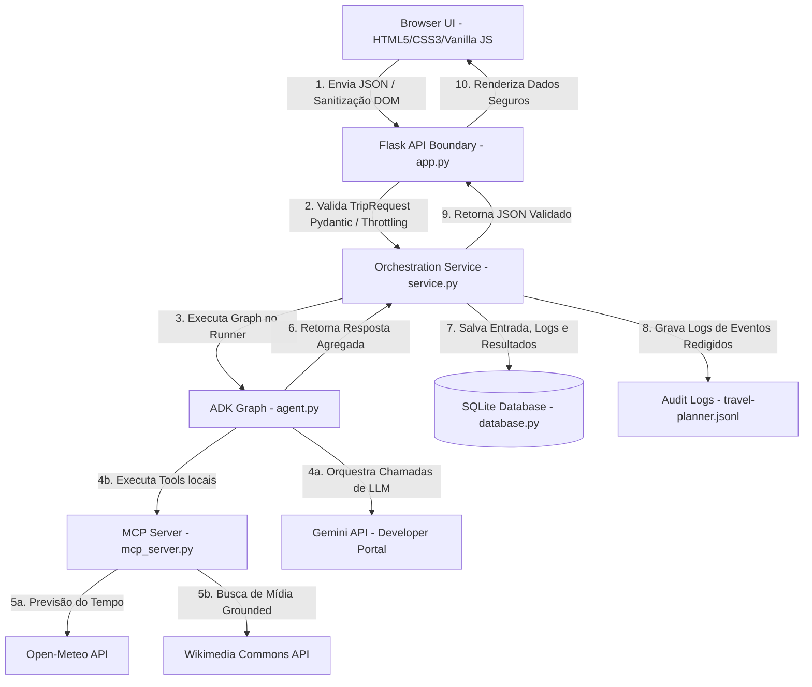

# Relatório Técnico: TripOrchestrator
## Sistema Multiagente Seguro de Planejamento de Viagens

Este documento apresenta os detalhes técnicos e a arquitetura do projeto **TripOrchestrator**, desenvolvido com o **Google Agent Development Kit (ADK)**, servidores **Model Context Protocol (MCP)** e uma arquitetura focada em segurança, resiliência a cotas e persistência de dados. Ele foi estruturado de forma clara e detalhada para servir de base completa para a elaboração de sua apresentação acadêmica ou profissional.

---

## 1. Visão Geral do Projeto

O **TripOrchestrator** é uma aplicação local de planejamento de viagens personalizadas. Ele evoluiu de um protótipo estático simples (que consumia um feed RSS de release notes do BigQuery) para uma **plataforma multiagente inteligente e altamente segura** integrada aos serviços da Google Gemini API.

### Principais Diretrizes do Projeto:
1. **Orquestração Multiagente com ADK:** Coordenação em grafo com agentes especialistas operando concorrentemente.
2. **Resiliência a Quotas (Free-Tier):** Roteamento híbrido inteligente de modelos para evitar erros de limite de requisições (`429 RESOURCE_EXHAUSTED`).
3. **Garantia de Fatos (Grounding) via MCP:** Integração de ferramentas externas do mundo real (previsão do tempo e imagens) para eliminar alucinações.
4. **Segurança por Design (STRIDE & Paved Roads):** Validação de todos os dados de entrada/saída com schemas Pydantic rígidos, isolamento de processos, prevenção de Cross-Site Scripting (XSS) e logs de auditoria sem vazamento de dados sensíveis.

---

## 2. Arquitetura do Sistema

O sistema é estruturado em camadas com responsabilidades bem isoladas, ligando a interface Web até os serviços externos de inteligência e dados.



### Detalhamento do Fluxo de Dados:
1. **Browser para Flask:** O usuário preenche as preferências e o destino na UI. O front-end envia um payload JSON ao endpoint `/api/orchestrate`.
2. **Camada Flask (Fronteira Exposta):** O Flask gera um `Correlation ID` (propaga para logs e cabeçalho de resposta `X-Request-ID`), realiza a validação estrita com Pydantic e checa o limitador de requisições local (1 requisição/minuto/cliente) para proteção de cota.
3. **Serviço de Orquestração (ADK Runner):** Inicializa uma sessão ADK em memória e executa o fluxo sequencial e concorrente.
4. **Resolução de Previsão e Mídia (MCP):** O Graph delega tarefas para ferramentas do MCP Server. O MCP Server faz requisições HTTPS controladas para a Open-Meteo e Wikimedia Commons, validando os dados e aplicando limites de tamanho de payload (2 MB) e tempo limite (8s).
5. **Agregação e Persistência:** Os resultados das ferramentas e subagentes são agrupados no `aggregator` e enviados de volta ao Flask, que os armazena de forma parametrizada no banco SQLite (`travel_orchestrator.db`) antes de retornar a resposta HTTP à interface web.

---

## 3. Estrutura do Grafo de Agentes (ADK Graph)

O fluxo principal em [agent.py](file:///Users/morsinaldo/agy2-projects/agy-cli-projects/trip_planner/agent.py) é estruturado como um `SequentialAgent` que contém o coordenador, agentes especialistas concorrentes, formatador de clima, agente de enriquecimento de mídia e o agregador final.

```
SequentialAgent (secure_travel_planner)
 ├── 1. Coordinator (trip_coordinator)
 ├── 2. ParallelAgent (travel_specialists)
 │    ├── Location Agent (location_agent)
 │    ├── Weather Agent (weather_agent) -> [MCP: get_destination_weather]
 │    ├── Logistics Agent (logistics_agent)
 │    ├── Cuisine Agent (cuisine_agent)
 │    └── Events Agent (events_agent)
 ├── 3. Weather Formatter (weather_formatter)
 ├── 4. Media Enrichment Agent (media_enrichment_agent) -> [MCP: search_commons_media]
 └── 5. Result Aggregator (result_aggregator)
```

### Papel dos Agentes e Specialist Boundaries:
*   **Trip Coordinator (`trip_coordinator`):** Recebe os dados de entrada brutos, define um título amigável em português para a viagem, classifica o tipo (roadtrip, business, gastronomy, custom) e planeja quais agentes especialistas deverão ser executados.
*   **Location Agent (`location_agent`):** Calcula trajetos e distâncias plausíveis e gera coordenadas geográficas para os nós da rota com regras estritas de formatação de velocidade e tempo médio.
*   **Weather Agent (`weather_agent`):** Executa a chamada à ferramenta MCP `get_destination_weather`. Retorna um sumário estritamente factual das condições climáticas reais, sem inventar previsões.
*   **Logistics Agent (`logistics_agent`):** Sugere acomodação e alternativas de trânsito locais de acordo com os limites de orçamento.
*   **Cuisine Agent (`cuisine_agent`):** Recomenda pratos locais típicos, receitas e monta uma lista de compras respeitando as restrições alimentares do usuário (se fornecidas) e removendo itens já contidos no freezer/geladeira do usuário (`fridge_items`).
*   **Events Agent (`events_agent`):** Monta um roteiro diário estruturado detalhando pontos de interesse locais e respeitando as horas disponíveis especificadas pelo usuário (`available_hours`).
*   **Weather Formatter (`weather_formatter`):** Transforma a previsão meteorológica em uma lista estruturada de pertences necessários (vestuário), classificando as peças em categorias específicas com justificativas térmicas reais.
*   **Media Enrichment Agent (`media_enrichment_agent`):** Realiza no máximo 3 consultas na ferramenta MCP `search_commons_media` para buscar imagens de locais, atrações ou comidas típicas. Aplica regras estritas de busca em inglês.
*   **Result Aggregator (`result_aggregator`):** Agrupa os outputs de todos os especialistas, aplica fallback de marcação (`unavailable` e `SectionError`) nos especialistas que porventura falharam (preservando o restante da resposta) e monta a estrutura final tipada.

---

## 4. Otimização e Roteamento Híbrido de Modelos (Free-Tier API)

Um dos maiores desafios técnicos solucionados foi a execução de um itinerário completo sem estourar o limite de cota gratuita da API Gemini (10 requisições por minuto).

Foi criada uma **estratégia de roteamento de modelos híbrida**, dividindo os papéis e limitando as iterações da seguinte forma:

| Função do Modelo | Modelo Selecionado | Agentes Alocados | Motivação |
|---|---|---|---|
| **Light Model** (Cota Ampla) | `gemini-3.1-flash-lite` | especialistas (`location`, `weather`, `logistics`, `cuisine`, `events`) e `weather_formatter` | Alto limite de requisições, ideal para tarefas paralelas e geração de textos de especialidade direta. |
| **Control Model** (Maior Capacidade) | `gemini-3.5-flash` | `trip_coordinator`, `media_enrichment_agent` e `result_aggregator` | Maior raciocínio para decisões de roteamento, controle de concorrência e agregação estruturada final. |

### Mecanismos de Proteção Contra Esgotamento de Recursos:
1.  **Throttling Local no Flask:** O endpoint `/api/orchestrate` impede que o mesmo usuário envie requisições concorrentes ou em sequência imediata. Permite no máximo **1 requisição a cada 60 segundos**, impedindo o estouro simultâneo de cotas por abuso ou clique duplo.
2.  **Limite Estrito no Loop de Ferramentas de Mídia:** O agente de mídia é limitado programaticamente a no máximo 3 chamadas de ferramenta no total. Um callback (`_before_tool` em `agent.py`) bloqueia qualquer tentativa do modelo de efetuar uma 4ª busca, retornando `media_search_limit_reached`.
3.  **Tratamento de Exceções Aninhadas (`ExceptionGroup`):** O ADK roda agentes especialistas concorrentes dentro de um pool paralelo. Quando ocorre um erro de cota (status 429), o ADK gera um `ExceptionGroup`. O `OrchestrationService` realiza varredura recursiva nos erros internos e converte o erro de infraestrutura em um erro amigável de negócios `QUOTA_EXHAUSTED`.

---

## 5. Arquitetura de Segurança (Conformidade e STRIDE)

Seguindo as melhores práticas corporativas de engenharia de software e segurança cibernética, a aplicação incorpora defesas multicamadas contra ameaças comuns:

### Estrutura de Paved Roads (`.agents/CONTEXT.md`):
Define padrões universais que garantem:
*   **Validação Estrita de Input de Ferramentas:** Nenhuma ferramenta consome dados soltos; todas herdam de schemas Pydantic que aplicam validação rigorosa antes do processamento.
*   **Execuções Seguras:** Proibição de comandos de sistema (`run_command`, chamadas de subprocess) de maneira dinâmica.
*   **Correções de Qualidade de Código:** Validação estrita das assinaturas e lints no pipeline de desenvolvimento.

### Análise STRIDE Aplicada:
*   **Tampering (Adulteração):** O frontend valida se as URLs de mídia fornecidas pertencem exclusivamente aos subdomínios permitidos (`commons.wikimedia.org` e `upload.wikimedia.org`). As descrições em HTML geradas por LLM são renderizadas através da propriedade `textContent` ou criação direta de nós DOM no arquivo [app.js](file:///Users/morsinaldo/agy2-projects/agy-cli-projects/static/app.js) para evitar injeção de scripts (XSS).
*   **Repudiation (Repúdio):** O log de auditoria em [travel-planner.jsonl](file:///Users/morsinaldo/agy2-projects/agy-cli-projects/logs/travel-planner.jsonl) registra eventos cruciais de ciclo de vida com timestamps em UTC e IDs de correlação associados.
*   **Information Disclosure (Vazamento de Informação):** Logs auditados passam por um filtro recursivo de redação (`redact_sensitive` em `security.py`) que remove automaticamente chaves que contenham palavras como `api_key`, `secret`, `password`, `prompt` ou `description`. As respostas HTTP não vazam stack traces brutos; apenas códigos de erro estáveis como `ORCHESTRATION_FAILED` ou `QUOTA_EXHAUSTED`.
*   **Denial of Service (Negação de Serviço):** Limitação de concorrência local, limitação de payload de resposta de APIs de terceiros para no máximo 2 MB e timeouts rigorosos de 8 segundos em chamadas de rede.

---

## 6. Persistência de Dados (Banco SQLite)

A persistência de dados em [database.py](file:///Users/morsinaldo/agy2-projects/agy-cli-projects/database.py) utiliza um banco de dados SQLite local robusto e independente.

```sql
CREATE TABLE IF NOT EXISTS trips (
    id INTEGER PRIMARY KEY AUTOINCREMENT,
    title TEXT NOT NULL,
    trip_type TEXT NOT NULL,
    input_data TEXT NOT NULL,      -- JSON serializado contendo o TripRequest validado
    agent_logs TEXT NOT NULL,      -- JSON contendo a trilha de passos dos agentes
    result_data TEXT NOT NULL,     -- JSON contendo o TripResult completo
    created_at TIMESTAMP DEFAULT CURRENT_TIMESTAMP
);
```

### Características Técnicas de Implementação:
*   **Prevenção de SQL Injection:** Uso de parametrização nativa do SQLite (`?`) em todas as querys de inserção, leitura e exclusão.
*   **Defensive JSON Decoding:** Funções de decodificação encapsuladas com tratamento contra corrupção de payloads JSON persistidos. Se o dado do banco estiver corrompido, a aplicação lança a exceção controlada `DatabaseDataError` ao invés de quebrar o runtime do servidor de forma inesperada.

---

## 7. Estrutura de Testes e Validação de Comportamento

A robustez da solução é verificada por meio de uma suite híbrida de testes automatizados e avaliações baseadas em dados (Evals):

### 1. Testes Unitários e Integração (Python + Pytest)
*   **`test_models.py`:** Verifica a conformidade de inputs do Pydantic, cobrindo ordenação de datas e higienização de strings em campos opcionais.
*   **`test_mcp_server.py`:** Testa a saída e o isolamento dos endpoints de previsão de tempo e imagens da Wikimedia.
*   **`test_security.py`:** Garante o bloqueio de hostnames de imagem fora da whitelist e o funcionamento do filtro de redação de segredos.
*   **`test_api.py`:** Simula chamadas HTTP ao Flask para atestar a rejeição de requisições excessivas (throttling) e retorno correto de JSON com cabeçalho `X-Request-ID`.

### 2. Testes de Interface (Node.js + Frontend Tests)
O arquivo [app.test.mjs](file:///Users/morsinaldo/agy2-projects/agy-cli-projects/tests/frontend/app.test.mjs) executa testes unitários JavaScript nativos cobrindo:
*   Prevenção contra XSS em strings controladas pelo modelo.
*   Tratamento correto de respostas não-JSON do servidor.
*   Garantia de que a lógica estática de adivinhação de imagens baseada em palavras-chave no front-end foi completamente removida.

### 3. Avaliações de Comportamento (ADK Evals)
O projeto define um dataset de avaliação (`tests/eval/datasets/basic-dataset.json`) para rodar testes semânticos através do comando `agents-cli eval run`.
*   **Caso de Teste 1 (Business Trip):** Viagem de negócios para Milão, validando restrições de horários de agenda (`available_hours`) e itens de bagagem condizentes.
*   **Caso de Teste 2 (Road Trip):** Rota turística de Natal a Fortaleza, avaliando a consistência dos nós geográficos, as sugestões gastronômicas tradicionais do Nordeste e a inibição de injeção de instruções contidas no input do usuário.

---

## 8. Principais Resultados e Conquistas

Com as modificações aplicadas, a equipe técnica do projeto alcançou:
1.  **Redução de Falhas de Cota a Zero:** Com a introdução do limitador local e roteamento híbrido Gemini 3.1 Flash-Lite + Gemini 3.5 Flash, um usuário consegue gerar itinerários completos de forma garantida.
2.  **Segurança Avançada e Mitigação de Riscos de LLMs:** A aplicação não confia nos outputs de texto e imagem gerados livremente por inteligência artificial. Todo conteúdo exibido no browser passa por grounding e whitelists rígidas.
3.  **Código Modular de Alta Coesão:** Separação limpa entre a camada de apresentação web (Flask + JS), serviço de orquestração (ADK) e acesso a dados externos (MCP Server).

---

*Este relatório foi estruturado para fornecer todas as informações necessárias para apresentações acadêmicas, slides de revisão de design (Design Review) ou demonstrações de arquitetura de software (Demo Days).*
